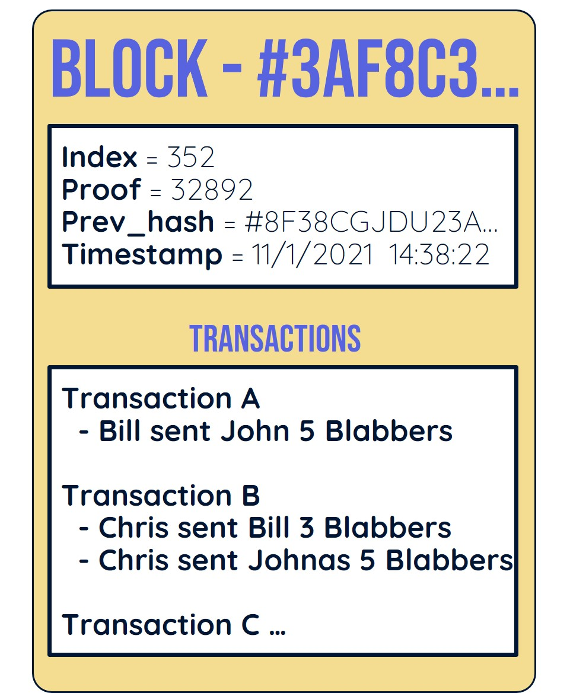
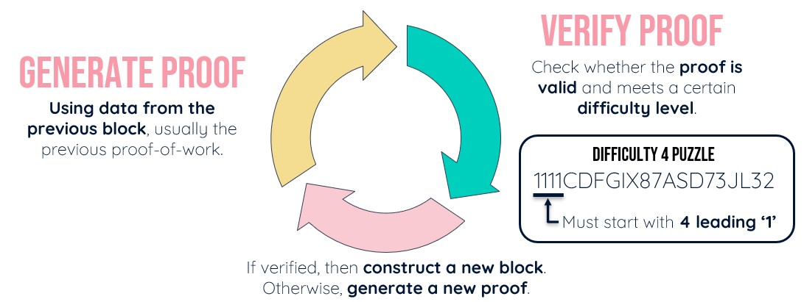
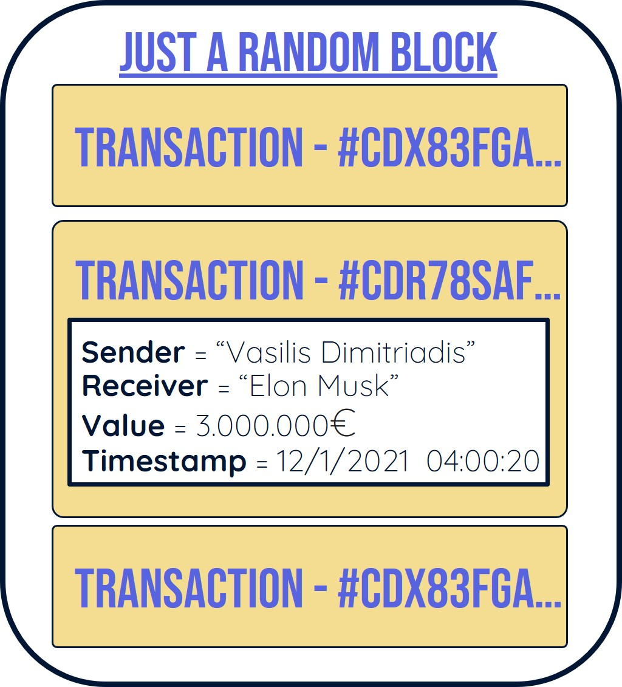
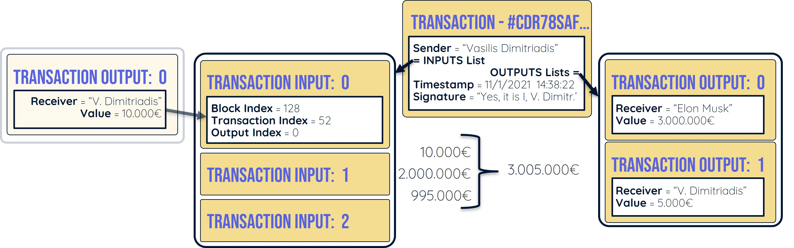
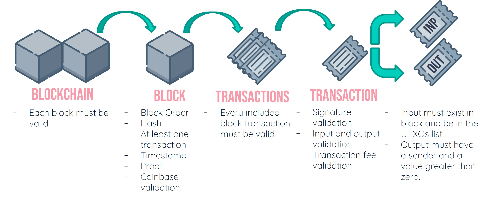

[![Contributors][contributors-shield]][contributors-url]
[![Forks][forks-shield]][forks-url]
[![Stargazers][stars-shield]][stars-url]
[![Issues][issues-shield]][issues-url]
[![MIT License][license-shield]][license-url]


<p align="center">
  
</p>

<br />
<p align="center">
  <h3 align="center">:link: Uncuffed - Blockchain secure messaging</h3>

  <p align="center">
    MSc Exercise for <u>Introduction to Computer Security</u>
    <br />
    A simulation of a blockchain messaging platform based on the Bitcoin protocol.
    <br />
    Exchange privately and securely messages and images. Become a miner and collect rewards 
    or just a plebeian client and send messages without supporting the platform.
    <br />
    <a href="http://icb.sci.uth.gr">University of Thessaly</a>
  </p>
</p>


<!-- TABLE OF CONTENTS -->
## Table of Contents
- [About The Project](#about-the-project)
- [Getting Started](#getting-started)
- [How Does It Work](#how-does-it-work)
  - [What is a Blockchain](#what-is-a-blockchain)
  - [Uncuffed users](#uncuffed-users)
  - [Block Structure](#block-structure)
  - [Proof-of-Work Algorithm](#proof-of-work-algorithm)
  - [Transactions](#transactions)
  - [UTXOs (Unspent Transaction Outputs)](#utxos-unspent-transaction-outputs)
    - [UTXO Example](#utxo-example)
  - [Validation](#validation)
  - [Message Payload](#message-payload)
  - [Peer Network (API)](#peer-network-api)
  - [Web Interface Routes](#web-interface-routes)
  - [Storage Data Routes](#storage-data-routes)
- [License](#license)
- [Authors](#authors)
- [Disclaimer](#disclaimer)
- [Acknowledgements](#acknowledgements)


<!-- ABOUT THE PROJECT -->
## About The Project
This project is inspired from [Bitcoin: A Peer-to-Peer Electronic Cash System](https://bitcoin.org/bitcoin.pdf).
A simplified version of the aformentioned paper, but with a message payload, was developed as part of an MSc Exercise for Introduction to Computer Security.
We implemented the following:
* Inspired from __Bitcoin__:
  * __Proof of Work Algorithm__, with fixed difficulty
  * __Lite__ and __Heavy__ Nodes
  * __Transactions__ and __Signatures__
  * __Peer Network__, but simplified and fixed (for DEMO Purposes)
  * __Incentive__, Exchanging CPU time for Blabbers (Uncuffed currency)
  * __Saving Disk Space__, with lite nodes storing only a lite-hash, while miners store the full tree. (No implementation of the Merkle Tree) 
  * __Payment Verification__ and __Value Splitting__, using UTXOs
  * __Privacy__, by using the public key for communication purposes
* __Chat features__:
  * __Message__ and __Image__ sharing, by attaching the message in the transactions payload
  * __Encrypting communication__ over the blockchain asymmetric encryption
  * __Web-based platform__ for easier demonstration
  * __Expandable__ if necessary in the future to add more message types
  * __Transfer of Wealth__. The bigger the messages, the more `Blabbers` you'll need to transmit it.


#### Built with plenty of [Python](https://www.python.org/) and pure :sparkling_heart:


<!-- GETTING STARTED -->
## Getting Started

Being the instructor, or just a random stranger, interested in this project is not easy. This is why we
have created a quick `Getting Started` guide to help you try out this project.


### Installation

1. [Download](https://github.com/WckdAwe/Uncuffed/archive/refs/heads/main.zip) or Clone the repo
   ```sh
   git clone https://github.com/WckdAwe/Uncuffed.git
   ```
2. Extract it on your desired location
3. Create a Virtual Environment and install all Dependencies
   ```sh
   py -m venv venv
   pip install -r requirements.txt
   ```
4. Start the project and enter a port
   ```sh
   py Uncuffed.py
   ```
   For demonstration purposes __choose on of the ports inside data/node_list.json__, ex. 5000, 5001 or 5002.
   The chosen port must be inside this node_list in order for the peers to communicate.

5. Open a browser and navigate to home with the appropriate port, ex. http://127.0.0.1:5000/

You must __repeat the process depending on the number of nodes you want to have__ in your system.


<!-- How does it work? -->
## How does it work

We are going to deep dive on how the Uncuffed project works by explaining how generic blockchain
projects work, and then seeing what we do slightly different.


### What is a Blockchain

<p align="center">
  
</p>

A blockchain is a list of a continuously ever-growing list of blocks,
which are linked together using a __cryptographic hash__.

<p align="center">
  
</p>

Each block contains a set of publicly viewable transactions which are stored permanently
on the blockchain. Additionally, each block may also include some meta-data required for the
calculations such as previous hashes, timestamps, difficulty, height etc.

All blockchain projects implement in one way or another the following characteristics:

* __Secure by Design__: They are _resistant_ to the modification of data, and become _immutable_
when sufficient time passes as the blockchain stabilizes
* __Decentralized__: Designed to work in Peer-to-Peer models, with __no central point of failure__
* __Permissionless__: Originally, they are designed open for the world. No secrets. No access-control needed.


### Uncuffed users

While using this project you will encounter two types of users/nodes, __Clients__ and __Miners__.

__Lite Nodes__ or __Clients__, can be used to send or receive messages in exchange for currency, `Blabbers`.
When receiving `Transactions` and `Blocks` by other nodes they simply store information that they may deem necessary, 
and echo the Transaction or Block before they discard it. This way clients help to propagate incoming messages to other
nodes.

__Full Nodes__ or __Miners__, are more important to the network. These nodes __store the whole blockchain__,
__validate__ incoming transactions or blocks and spend a considerable amount of their CPU power and storage to sustain
the network. As result, these nodes are also the ones __awarded currency when they successfully validate and attach blocks
to the blockchain__. Miners can be considered the labor-force of the network.


### Block Structure



The image contains a simplified and easier to understand block structure. The following characteristics remain
the same between different blockchain projects.

1. Every block is __unique__. Each block is identifiable by its unique hash or index.
2. Every block follows a __strict chronological order__. To be validated each new block must have a timestamp
higher than the previous one.
3. Every block is __linked with the previous one__. Each block has a field containing the `previous_block_hash`.
To be validated not only the index and timestamp must be higher than the previous block, but more importantly the
`previous_block_hash` must be valid!
4. Every block must __contain at least one transaction__.
5. Every block must be __validated by peers__.


### Proof-of-Work Algorithm

Proof of Work is the core mechanism that allows Uncuffed (and many other blockchain projects),
to come to a consensus decentralized and agree on account balances, transactions, messages etc. It is a solution
to a puzzle set by the blockchain to the miners. __Solving this puzzle means a Miner can be allowed to append his block
to the blockchain and be awarded for his contribution__.



As soon as a new valid block is received in a Miner's blockchain he starts generating a new Proof of Work.
The Miner uses the data from the previous block, usually the previous proof-of-work to solve the puzzle.

__What is the puzzle you may ask?__ To generate a random set of characters, the proof of work, where the first `X` (where X is difficulty)
characters must match a specific pattern. In the example above we can see a difficulty 4 puzzle, meaning the first 4 characters must match
a specific pattern, in this case `1111`.

This concept works fantastically because in order to generate those
random characters, using the data from the previous block (in this case the previous proof),
__it may take many thousands or millions of calculations depending on the difficulty__.

```sh
def verify_proof(prev_proof, proof, difficulty=2) -> bool:
    guess = f'{prev_proof}{proof}'.encode()
    guess_hash = SHA256.new(guess).hexdigest()
    return guess_hash[:difficulty] == "1" * difficulty

def proof_of_work(prev_proof: int, difficulty=2) -> int:
    proof = 0
    while verify_proof(prev_proof, proof, difficulty) is False:
        proof += 1

    return proof
```

To verify though that this proof is actually correct, we only need two variables;
The `previous proof` and the `proof` a miner claims to have found.

Meaning, a __Miner may take a huge amount of processing time in order to find a valid
proof-of-work that solves the puzzle, but as soon as he does any miner or client can verify
that proof with a single and fast calculation__.


In our case the puzzle is solved with fixed difficulty of 2, 
which is quite easy to be fair. But easy is what we are looking for in order to update the
user's chat faster.


### Transactions



Usually, transactions signal the transfer of wealth from a user to another. This remains
the case for Uncuffed, but with the additional payload of `PLAINTEXT` or `ENCRYPTED` messages.

Similarly to a block, each transaction is __uniquely identifiable by its hash__. This hash is
generated using the transactions contents, such as the sender, receiver, value and timestamp.


### UTXOs (Unspent Transaction Outputs)

The term UTXO refers to __the amount of digital currency someone has left__ after executing a transaction.

Each single transaction entity contains two lists; `Transaction Inputs` and `Transactions Outputs`

The first one, `Transaction Inputs`, is easier to understand. It can be considered as a Pointer 
to a specific `Transaction Output`.

The `Transacton Output` stores the transfer of wealth, meaning it is a "coupon" saying that the 
`X User has received Y amount of money`. Each transaction output can be considered either `SPENT` or
`UNSPENT`, aka `UTXO (Unspent Transaction Output)` or `STXO (Spent Transaction Output)`.

The simplest way to demonstrate this is with an example.


#### UTXO Example



In a __classical banking system__, Vasilis may have 3.005.000 Euros, which were
acquired by many years of hard work. That money is stored as a single variable, `money`,
in a database of a centralized bank. If Vasilis wanted to transfer
3.000.000 Euros to Elon Musk he could just write a check of 3.000.000 Euros and immediately his
bank account would update that `money` variable with his new balance.

In our __decentralized banking system__, this concept wouldn't be sustainable. As such lets consider
__we know the exact transactions__ where Vasilis got his 3.005.000 balance.
Specifically Vasilis received as single transactions:

* __2.000.000__ from an Index Fund
* __995.000__ from his job
* __10.000__ from a friend

Now for Vasilis to send that amount of money to Elon Musk he would have to collect all
these 'coupons' that say he has X amount of money (a.k.a `Unspent Transaction Outputs`) in a
single list (`Input List`).

Now Vasilis wants to send 3.000.000 to Elon Musk, but he has 3.005.000 Euros. As such he creates
a new list (`Output List`), where he sends 3.000.000 to Elon Musk and returns 5.000 to himself. 
The transaction is complete.

Although this might seem a complicated system, in actuality, this system allows every Miner to
keep track of the UTXOs and quickly verify if a single transaction is valid or invalid without
having to ask a central authority!


### Validation

We spoke of validation many times, but what exactly do we validate and how?

Validations occur on each element of the Blockchain, from the Blockchain itself
all the way to each single Transaction Input and Output.

We demonstrate the whole validation process starting from the whole Blockchain.
If someone wanted to validate a single element presented here, all he would need to do
is follow the graph and validate the ones right to it.



To be valid,

* __A Blockchain__, must validate all each blocks
* __A Block__:
  * Must have the correct ascending __block order__ in the blockchain
  * Must have a __valid hash__
  * Must have _at least one transaction__
  * Must follow a __strictly chronological order__ with its __timestamps__
  * Must have a __valid proof__
  * Must have a __valid miner reward__, which is the sum of the transaction fees + mining reward. 
    This transaction is called a `Coinbase Transaction`
* Each __Block's Transactions__ must be valid.
* Each __Transaction__:
  * Must have a __valid signature__, signed by the sender to verify ownership
  * Must have __valid transaction Inputs and Outputs__, meaning you can't send more than you have
  * Must have a valid __transaction fee__ going to a miner (0 or above)
* Each __Transaction Input__ must exist in a block and in order to be valid it must also
  exist in the UTXO list
* Each __Transaction Output__ must have a sender and a positive wealth exchange value


### Message Payload

By reading everything above you must have by now at least some basic knowledge over
how generic blockchains works and more importantly, how this blockchain works.

The last thing that we have to clarify about this project is how are these messages
sent all over the network. Each message is inserted as a `message payload` inside a
`Transaction Output`.

```
def __init__(self, recipient_address: str, value: int, message: Optional[AMessage]):
    self.recipient_address: str = recipient_address
    self.value: int = value
    self.message: Optional[AMessage] = message
```

The bigger the message, the more `Blabbers` you are going to need in order to transmit
the message. This is done by the following simple calculation, 
which in essence `Maximum between 1 and (message size in bits) / 64`:
```
@staticmethod
def calculate_minimum_blabbers(message: AMessage) -> int:
    return max(1, int(get_deep_size(message) >> 6)
```

The message payload is the combination of an enumerator `EMessageType` and
the actual string message `message`.

In this submitted version we support the following messages:
`Plain Text Message`, `Encrypted Message`, `Image Message` and 
`Encrypted Image Message`. Each one of these has its own dedicated class.

The `Plain Text Message` simple attaches the user's message in the `message` variable.

The `Encrypted Message` encrypts using the RSA Algorithm (with ECB style) prior to attaching
the user's message in the `message` variable. While this is not optimal 
for an actual blockchain, it is more than enough for this presentation.

The `Image Message` takes the uploaded image and converts it to a base64 string
prior to sending the message, while the `Encrypted Image` does exactly the same thing
but also uses the RSA Algorithm to encrypt it prior to sending it.

Upon receiving a message, a Client checks if the message is for him. If the message
is plaintext it just stores it directly. In the case where the message is Encrypted,
the client users his private key to decrypt the message and then stores it to his chat.


### Peer Network (API)

The following URLs are used by the system in order to function. Most likely you
are not going to mess with these. All the data transmitted are JSON serialized and
encoded prior to any transmission.

```
/api/broadcasts/new_block
/api/broadcasts/new_transaction
/api/blockchain/
/api/blockchain/length
/api/blockchain/blocks
/api/transactions/pending
/api/transactions/UTXO
/api/nodes/list
/api/nodes/info
/api/nodes/register
```

### Web Interface Routes

You are most likely going to encounter all of these urls while
you are demoing this project.

```
/                   - GET: HOME
/selector           - GET/POST: Selection between Client or Miner
/chat               - POST: Send messages through the blockchain
/chat/{other_addr}/ - GET/POST: See and Send messages through he blockchain
```

All HTML templates used for the Web Interface are store inside
`Uncuffed/templates`.


### Storage Data Routes

All local data are stored inside the `data` folder. Looking inside that folder
you are going to find the following.

```
/chats              - FOLDER: Contains all communications made between you and others
/chats/{id}.json    - FILE: Stores all communications between you and that address
/uploads            - FOLDER (UNUSED)
/blockchain.json    - FILE: Stores the whole blockchain
/node.json          - FILE: Stores node specific information, such as your UTXOs and STXOs
/node_list.json     - FILE: Stores all other nodes you are broadcasting messages to
/wallet.der         - FILE: Private key of your wallet
```


<!-- LICENSE -->
## License

Distributed under the MIT License. See `LICENSE.md` for more information.


<!-- Authors -->
## Authors

* __Dimitriadis Vasileios__ (WckdAwe) -- ( [Website](http://wckdawe.com) | [Github](http://github.com/WckdAwe) )


<!-- DISCLAIMER -->
## Disclaimer
All the information on this repository is provided in good faith, 
however we make no representation or warranty of any kind, express
or implied, regarding the accuracy, adequacy, validity, reliability,
availability or completeness of any information.

<!-- ACKNOWLEDGEMENTS -->
## Acknowledgements
* [Stack Overflow](https://stackoverflow.com/), The programmer's forever companion
* Medium | [Building a blockchain with < 60 Lines of code](https://medium.com/coinmonks/python-tutorial-build-a-blockchain-713c706f6531)
* IBM | [Getting started with blockchain](https://developer.ibm.com/gettingstarted/blockchain/)
* 101Blockchains | [Building a blockchain in Python](https://101blockchains.com/build-a-blockchain-in-python/)
* Investopedia | [UTXO](https://www.investopedia.com/terms/u/utxo.asp#:~:text=Here's%20how%20it%20works.,store%20change%20from%20cryptocurrency%20transactions.&text=When%20a%20transaction%20is%20completed%20and%20there%20are%20outputs%20that,date%20for%20a%20new%20transaction.)
* All image creators. Unfortunately I don't have the time to credit each one individually. If you wish for your images to be removed please contact me. They are only used for educational purposes of this project.

<!-- MARKDOWN LINKS & IMAGES -->
<!-- https://www.markdownguide.org/basic-syntax/#reference-style-links -->
[contributors-shield]: https://img.shields.io/github/contributors/WckdAwe/Uncuffed.svg?style=for-the-badge
[contributors-url]: https://github.com/WckdAwe/Uncuffed.svg/graphs/contributors
[forks-shield]: https://img.shields.io/github/forks/WckdAwe/Uncuffed.svg?style=for-the-badge
[forks-url]: https://github.com/WckdAwe/Uncuffed/network/members
[stars-shield]: https://img.shields.io/github/stars/WckdAwe/Uncuffed.svg?style=for-the-badge
[stars-url]: https://github.com/WckdAwe/Uncuffed/stargazers
[issues-shield]: https://img.shields.io/github/issues/WckdAwe/Uncuffed.svg?style=for-the-badge
[issues-url]: https://github.com/WckdAwe/Uncuffed/issues
[license-shield]: https://img.shields.io/github/license/WckdAwe/Uncuffed.svg?style=for-the-badge
[license-url]: https://github.com/WckdAwe/Uncuffed/blob/master/LICENSE.md